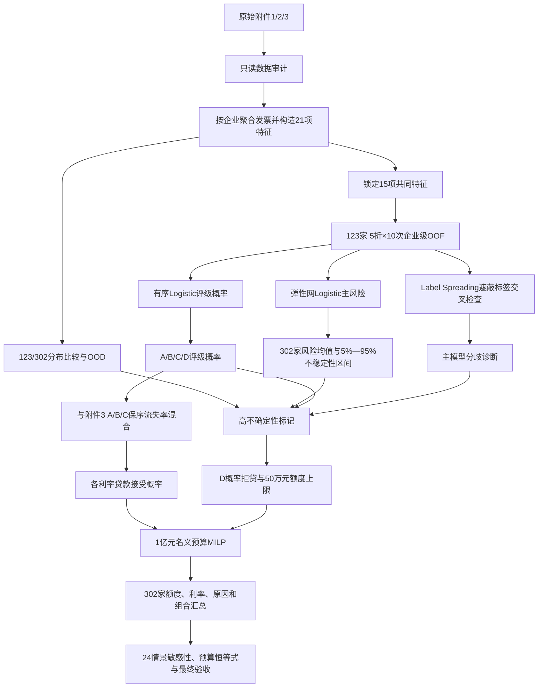

# 问题二 V1：问题分析报告

## 1. 这一问要求解决什么

原题要求：在问题一基础上，对附件2中302家无信贷记录企业的信贷风险进行量化，并在年度信贷总额为1亿元时给出信贷策略。

需要同时完成四件事：

1. 将问题一的发票数据处理和企业特征迁移到附件2；
2. 在附件2没有违约标签和真实信誉评级的条件下，预测每家企业的相对风险及A/B/C/D评级概率；
3. 将评级概率与附件3的利率—客户流失率关系连接，得到不同利率下的贷款接受概率；
4. 在1亿元总额、单家额度和利率范围内，决定“贷不贷、贷多少、利率多少”，并对分布迁移和模型不确定性实施保守控制。

## 2. 已知数据与字段

| 数据 | 规模 | 关键字段 | 在Q2中的作用 |
|---|---:|---|---|
| 附件1企业信息 | 123家 | 企业代号、企业名称、信誉评级、是否违约 | 有标签参考样本；训练风险与评级模型，做代理验证 |
| 附件1进/销项发票 | 210947 / 162484行 | 企业代号、发票号码、开票日期、金额、税额、价税合计、交易对手、发票状态 | 建立与Q1一致的企业级特征函数 |
| 附件2企业信息 | 302家 | 企业代号、企业名称 | 目标企业；没有信誉评级和违约标签 |
| 附件2进/销项发票 | 395175 / 330835行 | 与附件1相同的核心发票字段 | 生成302家同口径特征和风险诊断 |
| 附件3 | A/B/C各29个利率点 | 年利率、客户流失率 | 建立评级—利率—客户接受关系 |

共同观测月份为2016-10至2020-02，共41个月。金额建模单位为万元，原始“价税合计”除以10000。

## 3. 模型输入、输出和约束

### 3.1 输入

- 123家带违约/评级标签企业的15项主发票特征；
- 302家无标签企业的同口径15项主发票特征；
- 附件3 A/B/C评级的29个实际利率点及保序流失率；
- 名义预算10000万元；单家获贷额度10～100万元；利率4%～15%；
- 主场景参数：LGD=0.50、资金成本率=0.03、D概率阈值=0.80、高不确定性额度上限50万元。

### 3.2 输出

- 302家企业的主风险值、重复拟合不稳定性区间、Label Spreading诊断值；
- A/B/C/D评级概率、预测评级、OOD及不确定性原因；
- 302家“贷/不贷”、贷款额度、年利率和未放贷原因；
- 组合名义额度、预期发放、利息、信用损失、资金成本和情景净收益；
- 代理验证、预算恒等式、合理性、灵敏度和稳健性证据。

### 3.3 约束

- 每家企业至多选择一个利率；
- 获贷额度为10～100万元，否则为0；高不确定性企业上限50万元；
- 评级D概率不低于0.80的企业拒贷；
- 利率只能从附件3的29个4%～15%实际观测点选择；
- 主场景名义额度严格满足 Σsᵢ=10000万元；
- 附件2的302家无真实标签，不得虚构外部准确率或真实收益。

## 4. 最终需要得到的结果

1. 302家完整风险、评级概率和不确定性表；
2. 302家完整信贷策略表；
3. 主场景组合汇总和预算核对；
4. 风险模型、评级模型与半监督交叉检查的代理验证；
5. 123/302分布差异和OOD清单；
6. 对风险口径、LGD、资金成本、D阈值、不确定性上限、OOD阈值、区间阈值和预算口径的敏感性分析；
7. 高清图及每张图对应的源数据。

## 5. 与问题一的关系

可以继续使用：

- 完全相同的原子发票清洗、金额换算、状态映射和21项企业特征函数；
- 问题一锁定的15项主特征和弹性网Logistic风险Pipeline；
- 附件3 A/B/C递增保序流失率曲线；
- “风险—客户接受—情景净收益—额度/利率选择”的优化框架。

不能直接照搬：

- 附件1的人工信誉评级不能作为Q2风险输入，因为附件2没有该字段；
- 问题一的确定评级不能套到Q2，必须预测四级评级概率；
- 附件2没有真实违约标签，不能把附件1交叉验证指标写成302家外部指标；
- Q2预算固定为1亿元，且必须说明是名义额度还是预期实际发放口径。

## 6. 两种候选路线

| 候选 | 组成 | 优点 | 缺点/风险 |
|---|---|---|---|
| 方案A：监督迁移主方案 | 弹性网Logistic违约倾向 + 有序Logistic评级概率 + 概率混合流失率 + MILP | 小样本下参数受控、可解释；与Q1口径一致；可直接输出连续风险、四级概率和受约束策略 | 依赖123家参考分布；线性结构可能漏掉非线性；302家无标签，外部性能不可验证 |
| 方案B：半监督交叉检查 | KNN Label Spreading，把302家作为无标签图节点 + 不确定性降额/人工复核 | 能利用有标签与无标签样本的局部几何结构；可发现主模型排序分歧和训练支持不足 | 图结构对尺度、邻居数和分布迁移敏感；传播值不是目标真值；若直接作主模型容易被无标签分布牵引 |

可选但未作为正式Q2主比较的路线包括树模型和直接聚类评分。树模型在123家小样本上更易过拟合；无监督聚类不能自然对应“违约”语义，也无法提供经标签验证的概率，因此不作为正式主方案。

## 7. 最终选择及证据

最终采用“方案A为主、方案B只作交叉检查”。在123家企业聚合OOF代理验证中：

| 主要指标 | 方案A | 方案B | B−A的95%配对bootstrap区间 | 结论 |
|---|---:|---:|---:|---|
| PR-AUC（越高越好） | 0.681437 | 0.553560 | [-0.269164, 0.025591] | A点估计更好，区间跨0 |
| Brier（越低越好） | 0.109099 | 0.132646 | [-0.002726, 0.050744] | A点估计更好，区间跨0 |
| LogLoss（越低越好） | 0.360483 | 0.553135 | [0.033596, 0.374998] | A优势区间不跨0 |
| Top-20%风险召回 | 0.703704 | 0.629630 | [-0.218837, 0.050066] | A点估计更好，区间跨0 |

方案A在四项主要指标点估计均较好，方案B没有达到替代主模型的条件；但多数区间仍跨0，所以结论不是“方案A全面统计显著优于B”，而是“保留A作为稳定、可解释的主方案，B用于发现分歧和不确定性”。

## 8. 完整解题流程

## 9. 尚未解决的问题和风险

- 302家无真实违约和真实评级，无法做真正外部验证；当前123家指标只能称为代理验证。
- 没有统一违约观察期和违约发生日期，风险值不能严格解释为一年期PD。
- LGD、资金成本、D阈值和额度上限不是题目观测真值，只能作为透明情景参数并做敏感性。
- 原始数据存在少量金额算术不一致、重复键和发票号码冲突，审计为 `WARN`；当前流程保留审计记录并按登记规则处理，不能写成“数据无异常”。
- 50/302家企业至少有一项主特征超出附件1的1%～99%参考区间；分布迁移会削弱直接外推可信度。
- 评级概率由历史人工评级学习，可能继承人工先验；评级只用于接受率和D级控制，不回灌主违约模型。
- 当前策略是给定参数下的条件最优，不是现实利润保证。若有银行真实LGD、资金成本和审批政策，应替换情景参数后重新运行。
