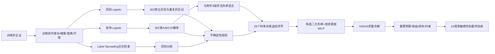

# 问题二 V2：数据处理与模型报告

本报告足以支持论文手撰写“数据处理、模型假设、模型建立与求解方法”。所有公式与当前代码一致；主场景没有执行的可选公式不会写成已使用方法。

## 1. 原始数据字段

| 表 | 字段 | 类型/单位 | 用途 |
|---|---|---|---|
| 企业信息 | 企业代号 | 字符串 | 企业主键，连接企业与发票 |
| 企业信息 | 企业名称 | 字符串 | 结果展示；不进入模型 |
| 附件1企业信息 | 信誉评级 | A/B/C/D | 有序Logistic因变量；不进入违约主模型 |
| 附件1企业信息 | 是否违约 | 是/否 | 风险模型监督标签；不作为特征 |
| 进/销项发票 | 发票号码 | 字符串 | 重复和冲突审计、原子发票聚合 |
| 进/销项发票 | 开票日期 | 日期 | 统一月份窗口、趋势和活跃性 |
| 进/销项发票 | 金额、税额、价税合计 | 元 | 以“价税合计”为正式金额，除以10000得到万元 |
| 进项发票 | 销方单位代号 | 字符串 | 供应商数量和集中度 |
| 销项发票 | 购方单位代号 | 字符串 | 客户数量和集中度 |
| 进/销项发票 | 发票状态 | 有效/作废 | 有效交易金额与作废率 |
| 附件3 | 贷款年利率 | 小数/百分数 | 29个4%～15%实际候选报价点 |
| 附件3 | A/B/C客户流失率 | 比例 | 保序拟合后计算贷款接受概率 |

附件2企业信息没有“信誉评级”和“是否违约”，程序对这两个目标字段设为禁用并自动验收其缺失。

## 2. 数据质量与清洗规则

### 2.1 缺失值

- 四张发票表的核心必需字段没有缺失；若企业级比率因分母为0无法定义，特征表保留 `NA`。
- 风险/评级Pipeline只用训练折中位数填补 `NA`，再把同一填补参数应用于验证折或302家目标企业；不使用全体样本中位数。
- 缺失交易对手不参与客户/供应商集中度分母；缺失被单独审计，不伪造交易对手代号。

### 2.2 重复、发票冲突和金额异常

- 完全重复行按配置 `keep_first` 去重；原始工作簿只读，审计报告保留原始重复数量。
- 发票业务键按“企业—发票号—日期—交易对手—状态”等原子口径核验；相同发票号的冲突组保留警告，不简单按发票号全删。
- 正式金额使用“价税合计”。金额+税额与价税合计不一致的行保留审计警告，不用另两列静默重算。
- 企业级连续特征的1%和99%缩尾界限只在训练折拟合；验证折和附件2使用训练折界限。
- 需要取对数的非负特征使用 `log(1+x)`；可正可负的经营净流入代理使用 `sign(x)log(1+|x|)`；弹性网和有序模型使用训练折拟合的RobustScaler。

### 2.3 作废、负数和零金额发票

- 有效正数发票计入正向购销规模；有效负数发票解释为退货/退款，保留其绝对金额并构造退货率。
- 作废发票不计入有效交易金额，但进入作废率分子和审计统计。
- 有效零金额发票保留在 `zero_amount_invoice_rate` 审计特征中；该字段不进入正式风险或评级模型。
- 零分母不强行赋予业务含义；无法定义的比率保留NA并在训练折填补。

原始审计状态为 `WARN`、错误数为0。警告主要来自少量金额算术不一致、重复业务键、完全重复和发票号码冲突；论文不得写成“数据完全无异常”。

## 3. 21项企业特征及经济含义

记企业 $i$ 在月份 $t$ 的有效正向销项/进项金额为 $G_{it}^{S},G_{it}^{P}$，有效净额为 $N_{it}^{S},N_{it}^{P}$，金额单位均为万元；共同月份数 $m=41$。

| 特征 | 经济含义 | 公式/定义 | 单位 | 角色 |
|---|---|---|---|---|
| `business_scale_10k` | 总体购销规模 | $\sum_t(G_{it}^S+G_{it}^P)$ | 万元 | 替代变量 |
| `sales_scale_10k` | 正向销售规模 | $\sum_tG_{it}^S$ | 万元 | 主模型 |
| `purchase_scale_10k` | 正向采购规模 | $\sum_tG_{it}^P$ | 万元 | 主模型 |
| `net_sales_10k` | 扣除退货后的销售净额 | $\sum_tN_{it}^S$ | 万元 | 替代变量 |
| `operating_net_inflow_proxy_10k` | 销售净额减采购净额，不是利润 | $\sum_t(N_{it}^S-N_{it}^P)$ | 万元 | 主模型 |
| `sales_growth_trend` | 销售时间趋势 | 回归 $\log(1+G_{it}^S)=a_i+b_it+e_{it}$ 的斜率$b_i$ | 每月 | 主模型 |
| `sales_monthly_cv` | 销售月度波动 | $\operatorname{sd}_t(G_{it}^S)/\operatorname{mean}_t(G_{it}^S)$ | 比例 | 主模型 |
| `invoice_activity_per_month` | 月均有效非零发票数 | 有效非零进销项原子票数/$m$ | 张/月 | 主模型 |
| `sales_return_rate` | 销售退货相对正向销售 | 销项负数绝对额/正向销售额 | 比例 | 主模型 |
| `purchase_return_rate` | 采购退货相对正向采购 | 进项负数绝对额/正向采购额 | 比例 | 主模型 |
| `void_invoice_rate` | 取消交易比例 | 作废原子票数/全部已知状态原子票数 | 比例 | 主模型 |
| `zero_amount_invoice_rate` | 有效零金额票审计比例 | 有效零额原子票数/有效原子票数 | 比例 | 仅审计 |
| `customer_count` | 正向销售覆盖客户数 | 正向销售额大于0的客户个数 | 个 | 主模型 |
| `supplier_count` | 正向采购覆盖供应商数 | 正向采购额大于0的供应商个数 | 个 | 主模型 |
| `customer_hhi` | 客户集中度 | $\sum_c w_{ic}^2$ | 比例 | 主模型 |
| `supplier_hhi` | 供应商集中度 | $\sum_v w_{iv}^2$ | 比例 | 主模型 |
| `max_customer_share` | 最大客户销售占比 | $\max_c w_{ic}$ | 比例 | 替代变量 |
| `max_supplier_share` | 最大供应商采购占比 | $\max_v w_{iv}$ | 比例 | 替代变量 |
| `purchase_sales_ratio` | 进销匹配关系 | $\sum_tG_{it}^P/\sum_tG_{it}^S$ | 比例 | 主模型 |
| `active_month_ratio` | 观察期交易月份覆盖 | 有交易月份数/$m$ | 比例 | 主模型 |
| `longest_active_streak_ratio` | 经营连续性 | 最长连续活跃月数/$m$ | 比例 | 替代变量 |

主模型固定使用15项，避免同时纳入高度重合的规模、最大份额和连续性变量；其余5项保留用于特征集敏感性，零金额比例只作审计。完整定义与解释风险见 `paper/q1/q1_feature_dictionary.md`；Q2调用的是同一实现。

## 4. 模型评价指标

| 指标 | 含义 | 方向 |
|---|---|---|
| PR-AUC | 关注少数违约类的排序质量，较适合27/123的类别不平衡 | 越高越好 |
| ROC-AUC | 随机违约企业排在随机未违约企业之前的概率型排序指标 | 越高越好 |
| Brier | 预测风险与0/1结果的均方概率误差 | 越低越好 |
| LogLoss | 对过度自信错误施加更强惩罚的概率对数损失 | 越低越好 |
| Top-20%召回 | 最高风险20%企业覆盖全部违约企业的比例 | 越高越好 |
| 校准误差ECE | 5个分位箱中预测概率与实际比例的加权偏差 | 越低越好 |
| 宏平均F1 | 四个评级类别F1的等权平均 | 越高越好 |
| 平衡准确率 | 四评级类别召回率的等权平均 | 越高越好 |
| 有序等级误差 | 预测评级编码与真实评级编码的平均绝对差 | 越低越好 |
| 加权Kappa | 对评级错一档/多档施加有序惩罚的一致性 | 越高越好 |

## 5. 模型假设

1. 附件1和附件2核心发票字段含义一致，可复用相同特征函数，但不假设两组企业同分布。
2. 企业是独立建模样本；同一企业的发票明细不会跨训练折和验证折。
3. 附件1历史违约标签可用于学习相对风险关系，但因缺少统一观察期，不解释为严格一年期PD。
4. A<B<C<D具有有序结构，可用比例优势累计Logistic建模。
5. 附件3 A/B/C流失率随利率整体非降，局部反向波动视为抽样噪声并用保序回归修正；不构造D级流失曲线。
6. 主场景的LGD、资金成本、D阈值和高不确定性额度上限是透明情景参数，不是附件观测真值。
7. 决策目标采用一年期参数化净边际收益近似；求解器最优只表示给定模型和约束下的条件最优。

## 6. 符号与单位

| 符号 | 含义 | 单位/范围 |
|---|---|---|
| $i\in\mathcal I_1,\mathcal I_2$ | 123家参考企业、302家目标企业 | — |
| $j=1,\dots,p$ | 主特征索引，$p=15$ | — |
| $x_i\in\mathbb R^{15}$ | 企业标准化发票特征向量 | 无量纲 |
| $y_i\in\{0,1\}$ | 历史违约标签 | 0/1 |
| $R_i\in\{A,B,C,D\}$ | 历史/预测信誉评级 | 有序类别 |
| $p_i$ | 优化使用的历史违约倾向代理 | $[0,1]$ |
| $\pi_{ig}$ | 企业$i$属于评级$g$的模型概率 | $[0,1]$，四级和为1 |
| $L_g(r_k)$ | 评级$g$在利率$r_k$下的保序客户流失率 | $[0,1]$ |
| $A_i(r_k)$ | 企业$i$在报价$r_k$下的贷款接受概率 | $[0,1]$ |
| $H_i$ | 高不确定性标记 | 0/1 |
| $e_i^D$ | D概率资格标记 | 0/1 |
| $x_{ik}$ | 是否给企业$i$选择利率$r_k$ | 0/1 |
| $s_{ik}$ | 对企业$i$在利率$r_k$的名义额度 | 万元 |
| $\ell$ | LGD情景参数 | 主场景0.50 |
| $c_f$ | 资金成本率 | 主场景0.03 |
| $B$ | 名义年度信贷预算 | 10000万元 |

## 7. 弹性网Logistic主风险模型

在每个训练折内完成中位数填补、1%～99%缩尾、对数变换和RobustScaler。设变换后特征为 $z_i$，则

\[
\hat p_i=\sigma(\beta_0+z_i^\top\beta),\qquad
\sigma(u)=\frac{1}{1+e^{-u}}.
\]

弹性网估计写为

\[
\min_{\beta_0,\beta}
-\frac1n\sum_{i=1}^{n}
\left[y_i\log\hat p_i+(1-y_i)\log(1-\hat p_i)\right]
+\lambda\left[\alpha\lVert\beta\rVert_1+
\frac{1-\alpha}{2}\lVert\beta\rVert_2^2\right].
\]

配置固定 `C=0.2`、`l1_ratio=0.8`、`solver=saga`、`max_iter=5000`、随机种子20260805。模型评价采用5折×10次重复分层交叉验证，共50个测试小块；每家企业恰好被测试10次，先对同一企业的10次OOF风险取均值，再计算企业级指标。

## 8. Label Spreading交叉检查

在每个遮蔽测试块中，训练折标签保留，测试折标签设为未知；302家附件2企业也作为无标签图节点。对K近邻相似图，标签分布迭代可概括为

\[
F^{(t+1)}=\alpha SF^{(t)}+(1-\alpha)Y,
\]

其中 $S$ 为标准化KNN相似矩阵，$Y$ 只含训练折已知标签。配置固定 `n_neighbors=10`、`α=0.2`、`max_iter=100`、`tol=0.001`。测试块真实标签只在预测后计分，不能参与图拟合或调参。

方案A、B在相同50个小块上配对比较。由于50个小块重叠，先按123家企业聚合，再做1000次企业级配对bootstrap；差值统一定义为B−A。

## 9. 有序Logistic评级概率

将A/B/C/D编码为0/1/2/3。比例优势模型为

\[
P(R_i\le h\mid z_i)=
\sigma(\theta_h-z_i^\top\gamma),\qquad h=0,1,2,
\]

并强制 θ₀<θ₁<θ₂。四级概率为

\[
\begin{aligned}
\pi_{iA}&=P(R_i\le0),\\
\pi_{iB}&=P(R_i\le1)-P(R_i\le0),\\
\pi_{iC}&=P(R_i\le2)-P(R_i\le1),\\
\pi_{iD}&=1-P(R_i\le2).
\end{aligned}
\]

损失为平均多分类负对数似然加斜率L2惩罚：

\[
\mathcal L(\gamma,\theta)=
-\frac1n\sum_i\log\pi_{i,R_i}
+\frac{\lambda_o}{2p}\lVert\gamma\rVert_2^2.
\]

配置为 λo=0.1、L-BFGS-B、`max_iter=2000`、`tol=10^{-8}`。最终阈值为 -1.499101、0.612464、3.180462，严格有序；302家四级概率逐行非负且和为1。

## 10. 流失率、接受率与不确定性

对附件3中评级 $g\in\{A,B,C\}$ 的原始流失率 $L_{gm}$，在非降约束下做保序回归：

\[
\min_{\widehat L_{g1}\le\cdots\le\widehat L_{gM}}
\sum_{m=1}^{M}(L_{gm}-\widehat L_{gm})^2.
\]

只在29个实际利率点报价。企业 $i$ 在利率 $r_k$ 下的接受概率为

\[
\boxed{A_i(r_k)=\sum_{g\in\{A,B,C\}}\pi_{ig}[1-L_g(r_k)]}.
\]

D级概率质量不重新分配，因此 $A_i(r_k)\le1-\pi_{iD}$。

主场景高不确定性标记为

\[
H_i=I\{\mathrm{OOD}_i\lor W_i\ge0.20\lor
\Delta_i^{LS}\ge0.20\lor E_i^\pi\ge0.75\},
\]

其中 $W_i$ 为重复折5%～95%风险区间宽度，$\Delta_i^{LS}$为主模型与Label Spreading风险绝对差，评级熵为

\[
E_i^\pi=-\frac1{\log4}\sum_g\pi_{ig}\log\pi_{ig}.
\]

主场景实际风险统一取 `main_risk_score`，即 $p_i=\hat p_i^{\text{full}}$；$H_i$ **只把单家上限从100万元降至50万元**，不把风险自动替换成p90。p90只在 `risk_variant=p90` 的单因素敏感性情景中使用。

D级资格为

\[
e_i^D=I\{\pi_{iD}<0.80\}.
\]

## 11. 目标函数与约束

单位名义授信的情景净边际收益为

\[
\kappa_{ik}=A_i(r_k)\left[(1-p_i)r_k-c_f-p_i\ell\right].
\]

决策变量 $x_{ik}\in\{0,1\}$、$s_{ik}\ge0$。主场景MILP为

\[
\boxed{
\begin{aligned}
\max_{x,s}\quad&\sum_{i\in\mathcal I_2}\sum_{k\in K}\kappa_{ik}s_{ik}\\
\text{s.t.}\quad
&\sum_{k\in K}x_{ik}\le e_i^D,&&\forall i,\\
&10x_{ik}\le s_{ik}\le U_i x_{ik},&&\forall i,k,\\
&\sum_{i,k}s_{ik}=10000,\\
&x_{ik}\in\{0,1\},\quad s_{ik}\ge0,
\end{aligned}}
\]

其中 $U_i=50$（$H_i=1$）或100（$H_i=0$），单位为万元。组合分解为

\[
\begin{aligned}
\mathrm{ED}&=\sum_{i,k}A_i(r_k)s_{ik},\\
\mathrm{Interest}&=\sum_{i,k}A_i(r_k)(1-p_i)r_ks_{ik},\\
\mathrm{EL}&=\sum_{i,k}A_i(r_k)p_i\ell s_{ik},\\
\mathrm{FundingCost}&=\sum_{i,k}A_i(r_k)c_fs_{ik},\\
\mathrm{NM}&=\mathrm{Interest}-\mathrm{EL}-\mathrm{FundingCost}.
\end{aligned}
\]

## 12. 参数来源

| 参数 | 主场景 | 来源/性质 |
|---|---:|---|
| 随机种子 | 20260805 | 配置锁定 |
| 重复分层CV | 5折×10次 | 小样本稳定性设计 |
| 弹性网C / l1_ratio | 0.2 / 0.8 | Q1锁定模型参数 |
| Label Spreading邻居/α | 10 / 0.2 | 评测前固定的交叉检查参数 |
| 有序Logistic L2 | 0.1 | Q2配置 |
| OOD参考区间 | 附件1的1%～99%分位 | 只由123家拟合 |
| D概率阈值 | 0.80 | 策略情景；另测0.70/0.90 |
| 不确定性额度上限 | 50万元 | 策略情景；另测30/70万元 |
| LGD | 0.50 | 情景参数；另测0.30/0.70 |
| 资金成本率 | 0.03 | 情景参数；另测0.02/0.04 |
| 名义预算 | 10000万元 | 题目1亿元，主解释为严格名义等式 |
| MILP误差/Gap | 10⁻⁶ / 10⁻⁶ | 求解配置 |

## 13. 求解算法流程

求解器为 `scipy.optimize.milp` 对HiGHS的接口。主场景包含16820个变量（8410个整数变量）和17111个约束；状态码0表示最优。若严格等式预算不可行，程序返回不可行并停止，不把等式悄悄改成上限。

## 14. 当前阶段结果与最终采用理由

- 123家代理验证：弹性网Logistic的PR-AUC=0.681437、Brier=0.109099、LogLoss=0.360483、Top-20%召回=0.703704；四项主指标点估计均优于Label Spreading。
- 有序Logistic企业聚合OOF：宏平均F1=0.440997、平衡准确率=0.428409、加权Kappa=0.637358、相邻一档内比例=0.951220。
- 302家分布迁移：绝对SMD均值0.121391、最大0.594619，50家OOD；模型阶段高不确定性257家。
- 主场景MILP：`optimal/PASS`，选择164家，名义额度10000万元，预算差额0。

选择监督迁移主方案的原因是：它复用Q1已锁定的可解释风险Pipeline，在关键不平衡概率指标上整体更好，并能自然连接有序评级概率和约束优化。Label Spreading保留为交叉检查，因为它能发现局部图结构分歧，但未达到替代主模型的预先标准。
